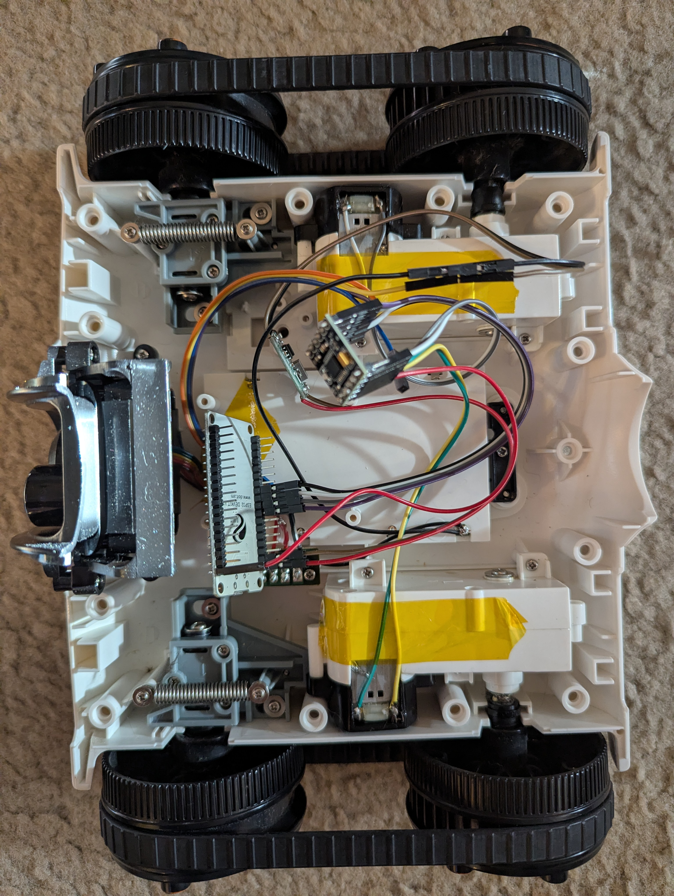
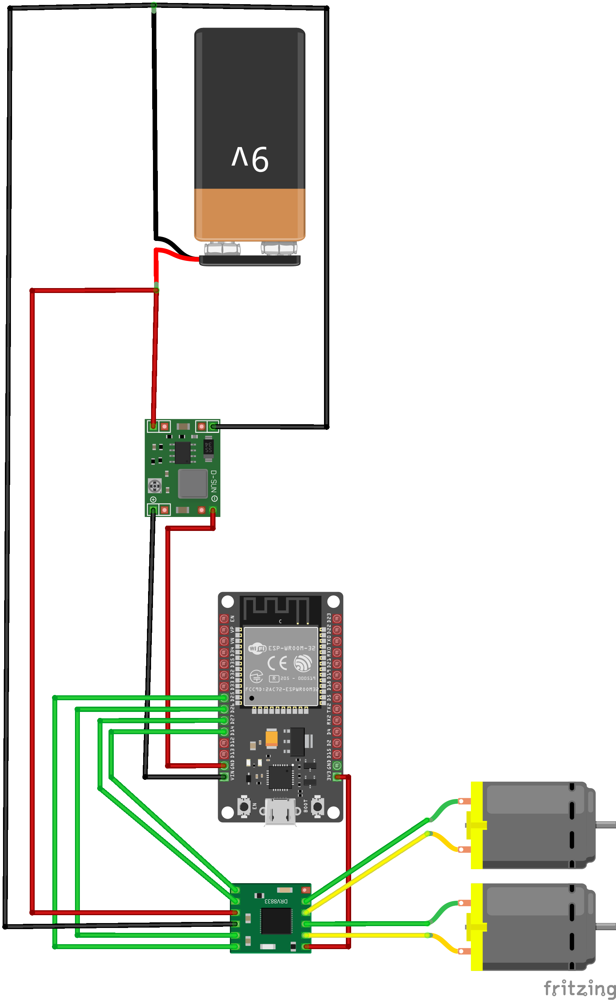

# Brookstone Rover, ESP32 Conversion

Firmware that converts a Brookstone Rover spy tank (tracked chassis, two DC
motors) into a Bluetooth-gamepad-controlled robot. The original WiFi board is
removed and replaced with an **ESP32 DevKit V1** driving a **DRV8833** dual
H-bridge, with a **BLE gamepad** (PS4 / PS5 / Xbox / generic) as the controller
via [Bluepad32](https://github.com/ricardoquesada/bluepad32). Tested with an
Xbox One Wireless Controller.


## Features

- **BLE gamepad control** through Bluepad32 (no app, pairs directly).
- **Arcade-style mixed drive**, left stick throttles and right stick steers.
- **Hardware PWM** via the ESP32 LEDC peripheral (20 kHz, 8-bit).
- **Deadzone** on the sticks to stop idle jitter.
- **Ramp limiter** for smooth acceleration that protects the gearbox.
- **Slow-decay drive** for more torque and speed per stick input.
- **Failsafe** that stops the motors immediately if the controller disconnects.

## Hardware

| Component | Part | Notes |
|---|---|---|
| MCU | ESP32 DevKit V1 (38-pin, ESP-WROOM-32) | USB micro |
| Motor driver | DRV8833 dual H-bridge breakout | Single-supply (VCC is the motor supply, no separate VM) |
| Power regulation | MP1584EN adjustable buck converter | Set to 5 V output |
| Battery | 6x NiMH AA (7.2 V nominal, ~7.6 V charged) | Rechargeable |
| Chassis | Brookstone Rover tank treads | Two independent tracks (left and right) |



## Wiring



### Motor control signals (ESP32 GPIO to DRV8833)

| ESP32 GPIO | DRV8833 | Motor |
|---|---|---|
| GPIO 14 | IN1 | Left, channel A |
| GPIO 27 | IN2 | Left, channel B |
| GPIO 26 | IN3 | Right, channel A |
| GPIO 25 | IN4 | Right, channel B |

- `OUT1`/`OUT2` go to the left motor terminals, `OUT3`/`OUT4` to the right.
- If a track runs backwards, swap its two `OUT` wires (or flip the sign in
  firmware). There is no need to rewire the GPIO.

### Power

- Battery **+** goes through the power switch, then splits to **buck IN+** and
  **DRV8833 VCC** (motor supply, about 7.6 V).
- Buck **OUT+ (5 V)** goes to ESP32 **VIN**, and buck **OUT- (GND)** goes to
  ESP32 **GND**. The ESP32 takes both its 5 V and its ground from the buck
  output, not from the battery directly.
- Battery minus ties to the buck input ground and the DRV8833 GND. Because the
  buck is non-isolated, its input and output grounds are the same node, so
  every ground (battery, buck, ESP32, DRV8833) ends up common.

### Enable pin (important)

This DRV8833 breakout has an **`EEP` / `nSLEEP`** pin that must be driven
**HIGH to enable** the driver. If it is left low (or its onboard pull-up
jumper is open) the chip stays asleep and **the motors will not move even
though everything else is correct**.

- Connect **`EEP` to ESP32 `3V3`**.
- Do **not** tie `EEP` directly to the battery or motor rail. The pin has a
  roughly 6.5 V clamp and is damaged by currents above about 250 µA. Use 3.3 V,
  or a 20 to 75 kΩ resistor to VCC.

## Control scheme

| Input | Action |
|---|---|
| **Left stick, up / down** | Throttle (forward / reverse) |
| **Right stick, left / right** | Steering (turn left / right) |

The two are mixed into the tracks as `left = throttle + steer` and
`right = throttle - steer`. At zero throttle, pushing the steer stick spins the
rover in place.

## Build and flash

This project uses [PlatformIO](https://platformio.org/). With the PlatformIO
CLI on your `PATH`:

```sh
pio run                       # build
pio run --target upload       # flash over USB
pio device monitor            # serial monitor @ 115200 baud
```

> On Windows the bundled CLI may not be on `PATH`. Prefix commands with:
> `$env:PATH += ";$HOME\.platformio\penv\Scripts";`
> Or just use the PlatformIO toolbar and tasks in VS Code.

The board environment is `esp32doit-devkit-v1` (see [platformio.ini](platformio.ini)).

### Bluepad32 note

Bluepad32 needs a Bluetooth-Classic-capable Arduino core, which the stock
ESP32 core does not provide. `platformio.ini` therefore overrides the core
with the precompiled Bluepad32 build via `platform_packages`, so no extra
`lib_deps` entry is required.

## Pairing a controller

Tested with an **Xbox One Wireless Controller** (Bluetooth model). PS4, PS5,
and other Bluepad32-supported gamepads should also work.

1. Flash the firmware and open the serial monitor.
2. Put the gamepad into pairing mode. For an Xbox One controller, turn it on
   with the **Xbox** button, then hold the small **Pair** button on the top
   edge until the Xbox light flashes quickly. (PS4: hold **Share + PS** until
   the light bar flashes.)
3. The ESP32 scans on boot. On success the monitor prints
   `Controller connected, index=0`.
4. To clear stored pairings, uncomment `BP32.forgetBluetoothKeys();` in
   `setup()`, flash once, then comment it back out.

## Tuning

Key constants live near the top of [src/main.cpp](src/main.cpp):

| Constant | Purpose |
|---|---|
| `RAMP_STEP` | Acceleration rate (higher is a snappier launch) |
| `DEADZONE` | Idle stick deadzone (about 10% of axis range) |
| `PWM_FREQ_HZ` | PWM frequency (20 kHz, above the audible range) |

## Known quirks

- **The left track twitches once at power-up.** GPIO 14 emits a brief PWM pulse
  during ESP32 boot, before the firmware takes over. It is harmless. To remove
  it, move `IN1` to a boot-clean GPIO (such as GPIO 13) and update
  `PIN_LEFT_IN1`, or add a 10 kΩ pull-down on GPIO 14.
- **The motors brake when you release the stick.** This is expected with
  slow-decay drive. The disconnect failsafe still coasts.
- The DRV8833 is a small driver (1.2 A continuous, 2 A peak per channel). For
  significantly more speed or torque, use a larger driver such as the TB6612FNG.

## Safety

- Verify the buck converter output is **5 V** with a multimeter before
  connecting the ESP32.
- Never tie the motor or battery rail directly to the ESP32 3.3 V rail or to the
  `EEP` pin.
- Watch the DRV8833 temperature on the first runs. If it gets hot, reduce the
  load or `RAMP_STEP`.
